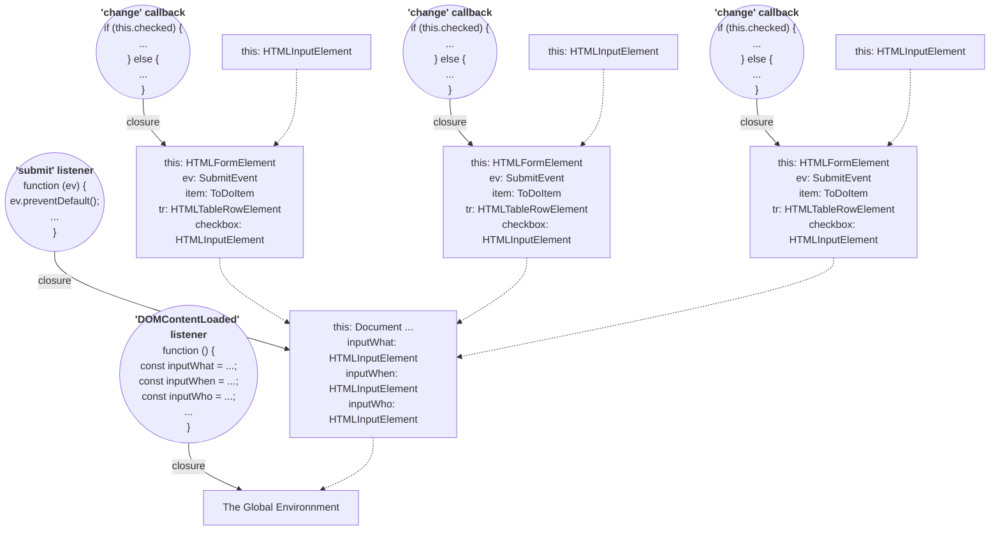

# Environment Model Diagram

```mermaid
graph TD
global[The Global Environnment]
dom-content-loaded(("<b>'DOMContentLoaded' listener</b><br>function () {<br>const inputWhat = ...;<br>const inputWhen = ...;<br>const inputWho = ...;<br>...<br>}")) --closure--> global
dom-content-loaded-frame[this: Document ...<br>inputWhat: HTMLInputElement<br>inputWhen: HTMLInputElement<br>inputWho: HTMLInputElement] -.-> global
submit(("<b>'submit' listener</b><br>function (ev) {<br>ev.preventDefault();<br>...<br>}")) --closure--> dom-content-loaded-frame
change-1(("<b>'change' callback</b><br>if (this.checked) {<br>...<br>} else {<br>...<br>}")) --closure-->
submit-f1[this: HTMLFormElement<br>ev: SubmitEvent<br>item: ToDoItem<br>tr: HTMLTableRowElement<br>checkbox: HTMLInputElement] -.-> dom-content-loaded-frame
change-1-f1["this: HTMLInputElement"] -.-> submit-f1
%% change-1-f2["this: HTMLInputElement"] -.-> submit-f1
%% change-1-f3["this: HTMLInputElement"] -.-> submit-f1
change-2(("<b>'change' callback</b><br>if (this.checked) {<br>...<br>} else {<br>...<br>}")) --closure-->
submit-f2[this: HTMLFormElement<br>ev: SubmitEvent<br>item: ToDoItem<br>tr: HTMLTableRowElement<br>checkbox: HTMLInputElement] -.-> dom-content-loaded-frame
change-2-f1["this: HTMLInputElement"] -.-> submit-f2
%% change-2-f2["this: HTMLInputElement"] -.-> submit-f2
%% change-2-f3["this: HTMLInputElement"] -.-> submit-f2
change-3(("<b>'change' callback</b><br>if (this.checked) {<br>...<br>} else {<br>...<br>}")) --closure-->
submit-f3[this: HTMLFormElement<br>ev: SubmitEvent<br>item: ToDoItem<br>tr: HTMLTableRowElement<br>checkbox: HTMLInputElement] -.-> dom-content-loaded-frame
change-3-f1["this: HTMLInputElement"] -.-> submit-f3
%% change-3-f2["this: HTMLInputElement"] -.-> submit-f3
%% change-3-f3["this: HTMLInputElement"] -.-> submit-f3
```
