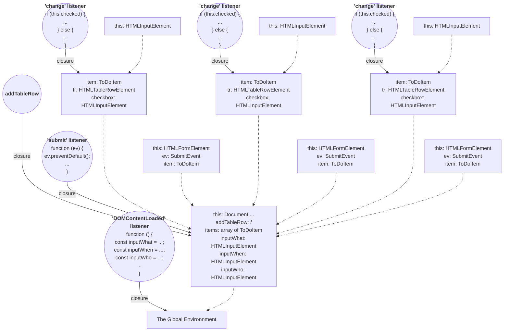

# Environment Model Diagram

```mermaid
graph TB
global[The Global Environnment]
dom-content-loaded(("<b>'DOMContentLoaded' listener</b><br>function () {<br>const inputWhat = ...;<br>const inputWhen = ...;<br>const inputWho = ...;<br>...<br>}")) --closure--> global
dom-content-loaded-f[this: Document ...<br>addTableRow: <i>f</i><br>items: array of ToDoItem<br>inputWhat: HTMLInputElement<br>inputWhen: HTMLInputElement<br>inputWho: HTMLInputElement] -.-> global
add-table-row(("<b>addTableRow")) --closure---> dom-content-loaded-f
submit(("<b>'submit' listener</b><br>function (ev) {<br>ev.preventDefault();<br>...<br>}")) --closure--> dom-content-loaded-f
change-1(("<b>'change' listener</b><br>if (this.checked) {<br>...<br>} else {<br>...<br>}")) --closure-->
add-table-row-f1["item: ToDoItem<br>tr: HTMLTableRowElement<br>checkbox: HTMLInputElement"] -..-> dom-content-loaded-f
submit-f1[this: HTMLFormElement<br>ev: SubmitEvent<br>item: ToDoItem] -.-> dom-content-loaded-f
change-1-f1["this: HTMLInputElement"] -.-> add-table-row-f1
%% change-1-f2["this: HTMLInputElement"] -.-> submit-f1
%% change-1-f3["this: HTMLInputElement"] -.-> submit-f1
change-2(("<b>'change' listener</b><br>if (this.checked) {<br>...<br>} else {<br>...<br>}")) --closure-->
add-table-row-f2["item: ToDoItem<br>tr: HTMLTableRowElement<br>checkbox: HTMLInputElement"] -..-> dom-content-loaded-f
submit-f2[this: HTMLFormElement<br>ev: SubmitEvent<br>item: ToDoItem] -.-> dom-content-loaded-f
change-2-f1["this: HTMLInputElement"] -.-> add-table-row-f2
%% change-2-f2["this: HTMLInputElement"] -.-> submit-f2
%% change-2-f3["this: HTMLInputElement"] -.-> submit-f2
change-3(("<b>'change' listener</b><br>if (this.checked) {<br>...<br>} else {<br>...<br>}")) --closure-->
add-table-row-f3["item: ToDoItem<br>tr: HTMLTableRowElement<br>checkbox: HTMLInputElement"] -..-> dom-content-loaded-f
submit-f3[this: HTMLFormElement<br>ev: SubmitEvent<br>item: ToDoItem] -.-> dom-content-loaded-f
change-3-f1["this: HTMLInputElement"] -.-> add-table-row-f3
%% change-3-f2["this: HTMLInputElement"] -.-> submit-f3
%% change-3-f3["this: HTMLInputElement"] -.-> submit-f3

```
